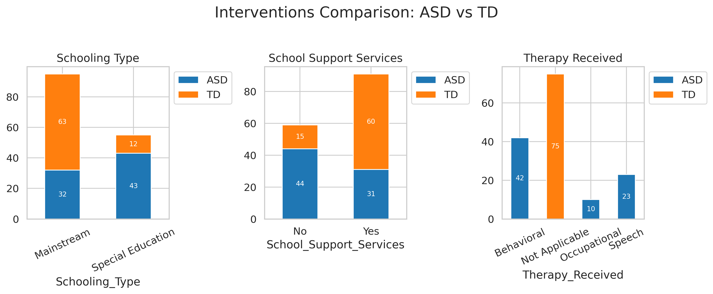

# QoL-Autism-Analysis
Comparative analysis of the quality of life in children with Autism Spectrum Disorder (ASD) vs their Typically Developing (TD) peers

## 📊 Project Overview
- **Goal:** Understand and visualize patterns in QoL among children with ASD
- **Approach:** Descriptive statistics, group comparisons (ASD vs TD), and association analysis
- **Techniques Used:** Data cleaning, visualization, non-parametric tests (e.g., Chi-square, Mann-Whitney U), correlation analysis

## 🧠 Key Research Questions

1. How does QoL differ between children with ASD and their typically developing (TD) peers?
2. Which factors are significantly associated with QoL within the ASD group?
3. Are demographic factors (e.g., gender, age) or clinical factors (e.g., severity, therapy) stronger predictors of QoL?
4. Are there key differences in the factors and living skills between children with ASD and their TD peers?

## Dataset Description
The dataset consists of 150 rows and 22 columns, covering a wide range of variables, including demographic, psychosocial, and physiological factors. It includes the following details; Group, Age, Gender, Socioeconomic Status, Parental Education, Severity of ASD Symptoms, Comorbid Conditions, Family Structure, Parental Mental Health Issues, Type of Schooling, Therapy Received, Daily Living Skills, Social Skills, Communication Skills, School Support Services, Peer Relationships, Social Inclusion, Physical Health, Emotional Well-being, Social Functioning, School Functioning, Overall Quality of Life

## 🛠️ Tools & Libraries
- Python (Pandas, NumPy, Seaborn, Matplotlib, SciPy)
- Jupyter Notebook

## Key Visualizations
### 🧠 Lifestyle vs Sleep Disorder

### Gender and Occupation vs Sleep Disorder

*More visuals in the notebook.*

## 📌 Notable Findings
- Gender was the only factor significantly associated with Quality of Life (QoL) among children with ASD.
Other variables such as:
- Severity of ASD
- Comorbid conditions
- Parental mental health issues
- Therapy received
showed no statistically significant association with QoL, even though some visual patterns suggested possible differences.

## 📚 Interpretation Notes
- Visualizations may sometimes suggest differences that aren't statistically significant.
- Statistical rigor was prioritized through the use of appropriate non-parametric tests due to the nature of the data.

## 🧩 Limitations
- Sample size and gender imbalance may influence results.
- Causality cannot be inferred from this analysis.

## 🌍 Project Impact
This project contributes to a better understanding of the lived experiences of children with Autism Spectrum Disorder (ASD) by examining factors that influence their Quality of Life (QoL). Key impacts include:
- **Advocacy through data:** Highlights the importance of considering gender-specific needs in interventions aimed at improving QoL in autistic children.
- **Guidance for caregivers and professionals:** By identifying which factors are not significantly associated with QoL, it challenges assumptions and helps focus attention on the child’s holistic experience rather than just clinical symptoms.
- **Evidence-based direction for future research:** The results suggest areas where deeper qualitative or longitudinal research may be needed to uncover subtler influences on QoL.
- **Empowerment for data-driven child health efforts:** Demonstrates how data analysis can be applied in public health to inform inclusive and child-centered care strategies.

🧭 This project is part of my journey to become a health data analyst focused on child health, using data to amplify the voices of vulnerable children and drive meaningful change in pediatric public health.
